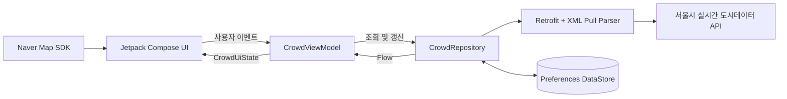

# 서울 혼잡도 레이더

> 서울시 실시간 도시데이터를 바탕으로 121개 주요 장소를 비교하고, 지금 방문하기 여유로운 곳을 찾는 Android 앱

선택한 장소의 혼잡도를 단순 조회하는 대신 **현재 덜 붐비는 장소를 먼저 제안**하는 데 초점을 맞췄습니다. 혼잡도, 추정 인구, 데이터 최신성을 함께 반영해 장소를 정렬하고 지도와 상세 지표로 판단 근거를 제공합니다.

## 프로젝트 한눈에 보기

| 항목 | 내용 |
| --- | --- |
| 목표 | 서울에서 지금 비교적 한산한 방문 후보를 빠르게 탐색 |
| 데이터 범위 | 서울시 공식 장소 121곳, 5개 카테고리 |
| 주요 화면 | 홈, 지도, 즐겨찾기, 설정, 장소 상세 |
| 지원 환경 | Android 12 이상 (`minSdk 31`) |
| 동작 모드 | 서울시 API 연동형 LIVE 모드 / 키 없이 확인 가능한 DEMO 모드 |

## 주요 기능

| 화면 | 제공 기능 |
| --- | --- |
| 홈 | 여유 장소 TOP 5, 장소명·영문명·코드 검색, 카테고리 필터, 페이지 탐색, 당겨서 새로고침 |
| 지도 | 네이버 지도 위 혼잡도별 색상 마커, 필터 결과 자동 포커싱, 선택 장소 요약 및 상세 이동 |
| 상세 | 추정 인구 범위와 변화 추세, 날씨, 미세먼지, 도로 소통 정보, 데이터 시각, 지도 앱 연결 |
| 즐겨찾기 | 저장한 장소를 혼잡도가 낮은 순서로 비교 |
| 설정 | 자동 갱신, 5·10·15분 캐시 유효 시간, LIVE/DEMO 연결 상태 확인 |

## 핵심 구현

### 제한된 API를 효율적으로 사용하는 갱신 정책

- 검색·필터 결과를 20곳씩 나누고 **현재 페이지만 갱신**해 요청 범위를 제한했습니다.
- TTL이 남은 데이터는 재사용하고, `Semaphore(2)`로 동시 요청 수를 제어합니다.
- `Mutex`로 중복 갱신을 막고 수동 새로고침에는 5초 쿨다운을 적용했습니다.
- 일부 요청이 실패해도 마지막 성공 데이터를 유지하고, 오래된 데이터와 갱신 실패 상태를 UI에 구분해 표시합니다.

### 하나의 반응형 UI 상태

DataStore의 스냅샷·즐겨찾기·설정 `Flow`와 화면 제어용 `StateFlow`를 `combine`해 불변 `CrowdUiState`로 만듭니다. Compose는 `collectAsStateWithLifecycle`로 이를 구독하며, 검색 입력은 600ms 지연 후 갱신해 불필요한 네트워크 요청을 줄였습니다.

### Compose와 네이버 지도 SDK 연결

`AndroidView`로 `MapView`를 포함하고 `LifecycleEventObserver`로 지도 생명주기를 Compose 화면과 동기화했습니다. 장소 코드를 키로 마커를 재사용하며, 필터 변경 시 필요한 마커만 추가·갱신·제거합니다. 혼잡도는 색상, 오래된 데이터는 투명도로 표현하고 결과 범위에 맞춰 카메라 중심과 줌을 계산합니다.

### 설명 가능한 추천 기준

TOP 5는 혼잡도 단계, 데이터 최신성, 추정 인구 중간값 순으로 정렬합니다. 인구 변화는 이전 값 대비 `max(1,000명, 5%)`를 넘을 때만 상승·하락으로 판단해 작은 변동으로 인한 표시 흔들림을 줄였습니다.

## 아키텍처



```text
app/src/main/java/com/chlqudco/seoulcrowdinglevelmap/
├── data/    API 통신, XML 파싱, 캐시, 장소 카탈로그, Repository
├── model/   혼잡도·장소 모델, 정렬·추세·페이지 로직
├── ui/      화면, 공통 컴포넌트, ViewModel
└── ui/theme Material 3 색상·타이포그래피·테마
```

## 기술 스택

| 영역 | 기술 |
| --- | --- |
| Language | Kotlin 2.2.10, Coroutines, Flow |
| UI | Jetpack Compose, Material 3 |
| Architecture | ViewModel, Repository, Unidirectional Data Flow |
| Network | Retrofit 2, XmlPullParser |
| Local data | Preferences DataStore, JSON |
| Map | Naver Map SDK |
| Test | JUnit 4, AndroidX Test, Espresso, Compose UI Test |
| Build | Gradle Kotlin DSL, Version Catalog |

## 실행 방법

최신 Android Studio와 Android SDK 37을 준비합니다. 네이버 클라우드 플랫폼 Maps에서 Dynamic Map을 활성화하고 Android 앱 패키지로 `com.chlqudco.seoulcrowdinglevelmap`을 등록한 뒤, 루트의 `local.properties`에 키를 추가합니다.

```properties
SEOUL_API_KEY=서울_열린데이터광장_인증키
NAVER_MAP_KEY_ID=네이버_지도_키_ID
```

`local.properties`는 Git에서 제외됩니다. `SEOUL_API_KEY`가 없으면 `sample` 키로 광화문·덕수궁 한 곳을 조회하고 나머지 120곳은 체험 데이터로 동작합니다. 지도 키가 없을 때는 지도 화면에 설정 안내를 표시합니다.

```powershell
.\gradlew.bat :app:assembleDebug
```

생성된 APK는 `app/build/outputs/apk/debug/app-debug.apk`에서 확인할 수 있습니다. macOS와 Linux에서는 `./gradlew`를 사용합니다.

## 테스트 및 품질 확인

```powershell
.\gradlew.bat :app:testDebugUnitTest
.\gradlew.bat :app:connectedDebugAndroidTest
.\gradlew.bat :app:lintDebug
```

도메인 단위 테스트는 API 혼잡도 매핑, 추천 정렬, 인구 추세, 121개 장소 카탈로그 무결성, 페이지 분할을 검증합니다. 계측 테스트는 연결된 Android 12 이상 기기 또는 에뮬레이터가 필요합니다.

## 현재 범위와 개선 방향

- 고정된 121개 스냅샷은 DataStore에 JSON으로 저장합니다. 장기 이력과 통계 기능을 추가할 경우 Room과 명시적 마이그레이션을 적용할 수 있습니다.
- 서울시 API가 HTTP로 제공되어 현재 cleartext 통신을 허용합니다. 배포 환경에서는 HTTPS 중계 서버와 제한적인 네트워크 보안 설정이 필요합니다.
- 클라이언트에 주입되는 API 키는 완전한 비밀이 될 수 없습니다. 실제 서비스에서는 서버 프록시, 키 사용처 제한, 호출량 모니터링을 함께 적용해야 합니다.
- 현재 테스트는 핵심 도메인 로직 중심입니다. XML 파서, Repository 장애 시나리오, Compose 화면 상호작용 테스트를 확장할 계획입니다.

## 데이터 출처 및 유의사항

- 서울 열린데이터광장 실시간 도시데이터
- 네이버 지도 SDK

혼잡도와 인구는 통신사 기반 추정치이므로 실제 현장과 차이가 날 수 있습니다. 앱의 TOP 5는 방문 후보 탐색을 돕는 정보이며 안전을 보장하는 지표가 아닙니다.
